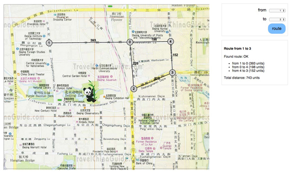

## Installation

- Download all files into a directory
- Optionally replace the map.png background image
- Open index.html in a modern browser

## Instructions

- paste generated code from https://github.com/julianbrowne/shortest-path-d3-mapper-example
- select source node id
- select target node id
- click 'route' button

